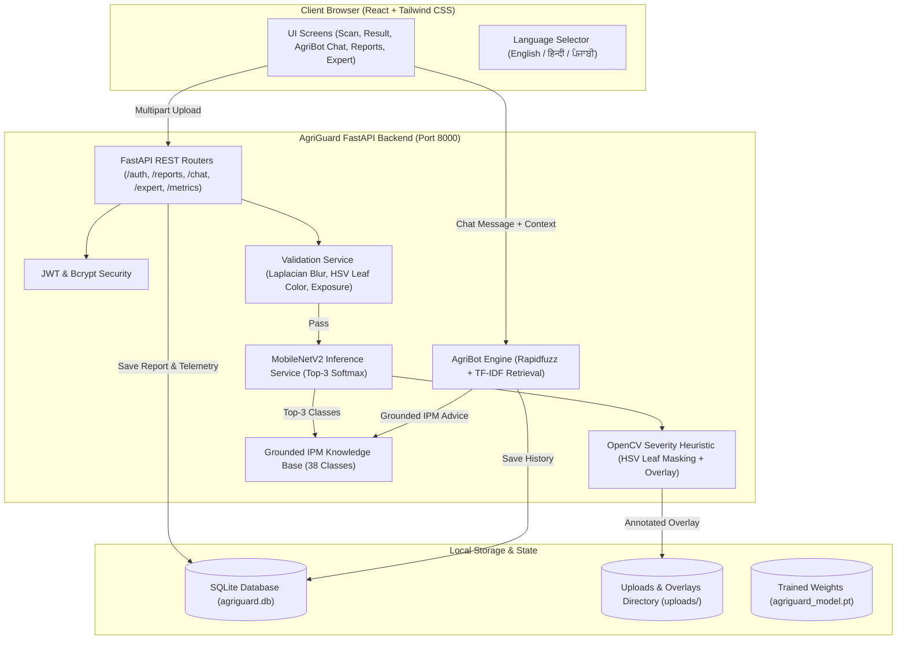

# 🌿 AgriGuard

> **Local AI-Powered Crop Disease Diagnosis, Severity Estimation & Agrarian Advisory System**

AgriGuard is a production-grade, offline-first agricultural diagnostics application. A farmer uploads or captures a photo of a crop leaf. A locally hosted deep learning model (**MobileNetV2**) identifies the plant condition, an **OpenCV computer vision pipeline** calculates the affected severity area and generates a visual overlay, and a comprehensive **Integrated Pest Management (IPM)** cure plan is generated. Farmers can then chat with **AgriBot**, an offline multilingual conversational assistant, to clear doubts about treatments, organic remedies, and safety precautions.

---

## 🔒 100% Offline & Free Architecture (Hard Constraints)
- **Zero Paid Services & Zero Cloud AI APIs**: Runs entirely on local hardware using open-source tools.
- **Local Inference**: PyTorch CPU inference on a pre-trained MobileNetV2 checkpoint (`ml/outputs/agriguard_model.pt`).
- **Database**: SQLite with SQLAlchemy ORM and automatic migrations.
- **Local Chatbot**: Rule-based intent detection engine powered by scikit-learn TF-IDF vectorization and Rapidfuzz token matching (optional Ollama adapter, off by default).
- **Environment**: Only `DATABASE_URL` and `JWT_SECRET` in `.env`.

---

## 🏛️ System Architecture



---

## 📦 Tech Stack

- **Backend**: Python 3.11+, FastAPI, SQLAlchemy, SQLite, Pydantic v2
- **ML & Vision (Production)**: ONNX Runtime CPU (ultra-lightweight), OpenCV Headless (`cv2`), Pillow (PIL), NumPy (No PyTorch at runtime in production)
- **ML Training / Dev**: PyTorch 2.5 CPU, Torchvision, ONNX export
- **Chatbot NLP**: Scikit-Learn (TF-IDF vectorizer lazily loaded), Rapidfuzz, optional Ollama HTTP adapter
- **Security**: JWT (`pyjwt`), Bcrypt password hashing
- **Frontend**: React 19, Vite, Tailwind CSS v4, Lucide Icons (Served as static SPA directly from FastAPI)
- **Containerization & Cloud**: Docker multi-stage build (`node:20-alpine` + `python:3.11-slim`), Render Web Service Blueprint (`render.yaml`)
- **Testing & Quality**: Pytest, Pytest-Asyncio, HTTPX

---

## 🚀 Quickstart & Setup Guide

### 1. Prerequisites
- **Python 3.11+** installed
- **Node.js 18+** and **npm** installed (for local frontend development)

### 2. Local Production Mode (Single Process)
```bash
# 1. Activate Python virtual environment
.\.venv\Scripts\activate  # Windows
# source .venv/bin/activate  # Linux/macOS

# 2. Build Frontend
cd frontend && npm install && npm run build && cd ..

# 3. Start Unified Server
uvicorn backend.main:app --host 0.0.0.0 --port 10000 --workers 1
```
*Visit `http://localhost:10000` for the complete application, `/health` for the health check, and `/docs` for Swagger API documentation.*

---

## ☁️ Deployment on Render Free Web Service

AgriGuard is designed to run effortlessly within Render's **512 MB RAM Free Tier** limit:
- **Runtime RAM**: ~120 - 150 MB (far below the 512 MB limit)
- **Blueprint Deploy**: Connect your GitHub repository to Render and use `render.yaml`.
- **Complete Step-by-Step Guide**: See [DEPLOY.md](DEPLOY.md).

---

## 🔑 Pre-Configured Demo Accounts

When `SEED_DEMO=true` is set (default in production and testing), demo accounts are created automatically on boot:

| Role | Email | Password | Features Available |
|------|-------|----------|--------------------|
| **Farmer** | `ramesh@farmer.in` | `farmer123` | Scan leaves, view diagnoses, access IPM cure plans, chat with AgriBot, manage history |
| **Expert** | `expert@agriguard.in` | `expert123` | Access Expert Dashboard, audit queue, submit certified diagnoses reviews, view telemetry |

---

## 📡 API Reference Overview

| Method | Endpoint | Description | Auth Required |
|--------|----------|-------------|---------------|
| `POST` | `/auth/register` | Register a new user (`farmer` or `expert`) | Public |
| `POST` | `/auth/login` | Login and receive JWT access token | Public |
| `GET` | `/auth/me` | Retrieve authenticated user profile | Bearer Token |
| `GET` | `/supported-crops` | List all 14 supported crops and 38 classes | Public |
| `POST` | `/reports` | Upload leaf image (multipart) for full diagnosis | Bearer Token |
| `GET` | `/reports` | Retrieve user diagnosis reports with filters | Bearer Token |
| `GET` | `/reports/{id}` | Retrieve individual diagnosis report details | Bearer Token |
| `DELETE` | `/reports/{id}` | Permanently delete diagnosis report & files | Bearer Token |
| `POST` | `/chat` | Send question to AgriBot (grounded on diagnosis) | Bearer Token |
| `GET` | `/conversations` | List user chat conversations | Bearer Token |
| `GET` | `/conversations/{id}/messages` | Retrieve conversation message history | Bearer Token |
| `DELETE` | `/conversations/{id}` | Delete conversation and messages | Bearer Token |
| `GET` | `/expert/reports` | View diagnosis audit queue (expert only) | Expert Role |
| `POST` | `/reports/{id}/review` | Submit agronomist review verdict & comments | Expert Role |
| `GET` | `/metrics/summary` | Operational telemetry (success rate, latency) | Public |

---

## 🧪 Testing & Verification

Run the comprehensive automated test suite covering authentication, MobileNetV2 inference, OpenCV severity heuristic, knowledge base compliance, leaf validation filters, chatbot intents, and security access controls:

```bash
# Run all 24 pytest unit and integration tests
.\.venv\Scripts\pytest.exe -v
```

All 24 tests run hermetically against an isolated database with 100% pass rate.

---

## 🌾 Supported Crops & Diseases (38 Classes)

AgriGuard is trained specifically on the following 14 crop families:
1. **Apple**: Apple scab, Black rot, Cedar apple rust, Healthy
2. **Blueberry**: Healthy
3. **Cherry**: Powdery mildew, Healthy
4. **Corn (Maize)**: Gray leaf spot, Common rust, Northern leaf blight, Healthy
5. **Grape**: Black rot, Esca (Black measles), Leaf blight, Healthy
6. **Orange**: Citrus greening (Huanglongbing)
7. **Peach**: Bacterial spot, Healthy
8. **Bell Pepper**: Bacterial spot, Healthy
9. **Potato**: Early blight, Late blight, Healthy
10. **Raspberry**: Healthy
11. **Soybean**: Healthy
12. **Squash**: Powdery mildew
13. **Strawberry**: Leaf scorch, Healthy
14. **Tomato**: Bacterial spot, Early blight, Late blight, Leaf mold, Septoria leaf spot, Spider mites, Target spot, Tomato yellow leaf curl virus, Tomato mosaic virus, Healthy

*A clear agricultural limitation notice is presented on the upload screen reminding users that unlisted crops may be misidentified.*

---

## 🛡️ Agricultural Safety Protocol
1. **Active Ingredients Exclusively**: No proprietary commercial brands are endorsed; only generic active chemical compounds are specified.
2. **Integrated Pest Management (IPM)**: Cultural hygiene, mechanical sanitation, and organic biological controls are always presented first; synthetic chemical treatments are reserved as a strictly monitored last resort.
3. **Safety Warnings**: Mandatory Personal Protective Equipment (PPE), Pre-Harvest Intervals (PHI), pollinator safety (protecting honeybees), and aquatic buffer zones are enforced on all chemical recommendations.
